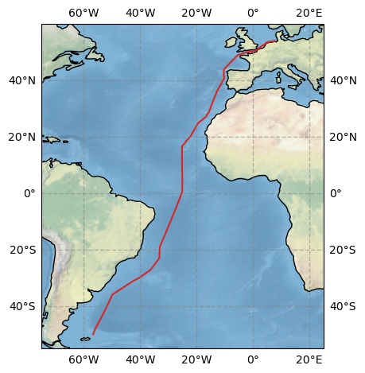
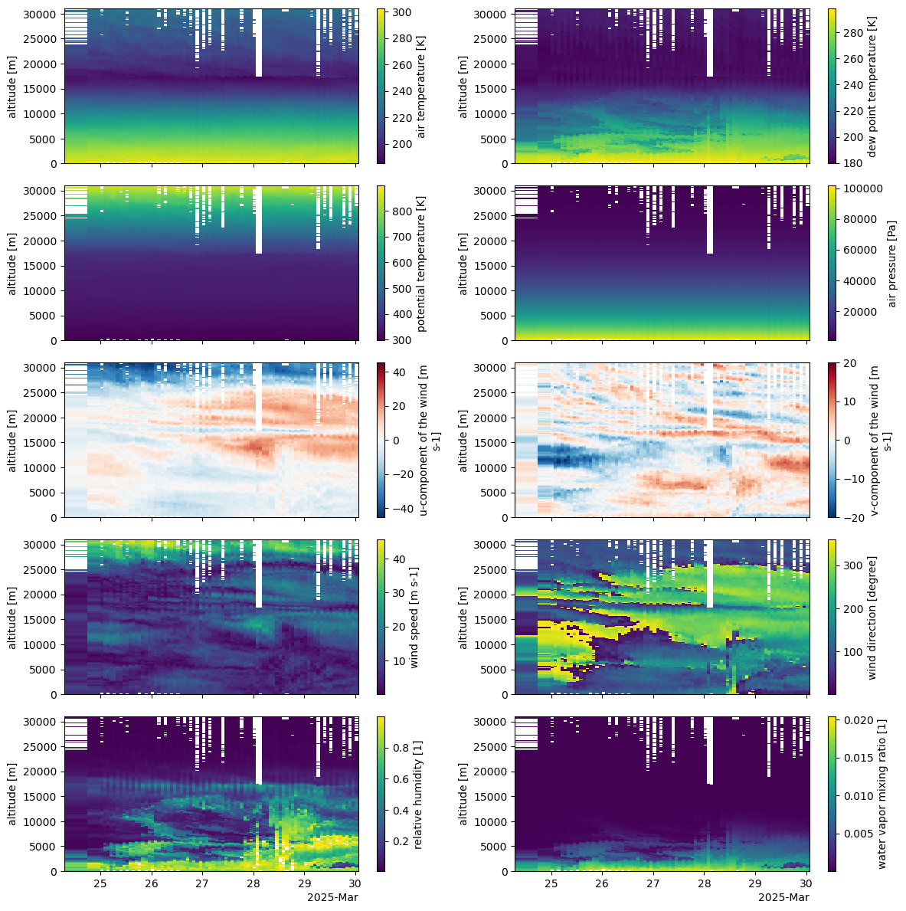

# PS147: processing of the atmospheric data

[](UPDATE!)
This repository contains references to the atmospheric measurements and their post-processing steps of the cruise *Atlantic Transit * with the identifier *PS147* on the RV Polarstern.

The cruise started March 12, 2025 in Stanley, Falkland, and ended April 14, 2025 in Bremerhaven, Germany.

Further general information about the cruise can be found in the [expedition programme](https://epic.awi.de/id/eprint/60028/1/Expedition%20prorgramme%20PS147.pdf) and the [cruise report](UPDATE!).

## Data sets

The data from the different instruments have been standardised with the [shipspy](https://github.com/shipspy-development/shipspy) package to simplify the comparison between different instruments and campaigns as much as possible. For reprocessing the data run `reprocess.sh`.

### Cruise track


The continuous measurements (Ship integrated sensors, PAMOS, and IWV) contain data of the time period from 2025-03-13 10:00 until 2025-04-13 22:00 with some data gaps specified in [shipspy_settings/PS147_sections.txt](https://github.com/LauraKoehler/ps147_processing/blob/main/shipspy_settings/PS147_sections.txt). The start point is at 49.99˚S and 56.69˚W, the end point is at 53.86˚N and 7.77˚W. Radiosondes were launched once a day at 11 UTC except from the moist tropics where the launch frequency was 3 hours. The data is divided in three sections by the coordinate `section`: section 0 is the first part until the moist tropics, section 1 is the crossing of the moist tropics, and section 2 is the last part until Bremerhaven.

## Minimal plotting examples

### Radiosoundings in the ITCZ

Here we show how to plot the radiosonde data within the ITCZ using the section coordinate to select the period.

```python
fig, axs = plt.subplots(5,2,figsize=(12,12),sharex=True)

radio_level2 = xr.open_dataset("ps147_radiosondes_level2.nc")
itcz = radio_level2.groupby("section")[1]

vars_to_plot = ["t_air", "dp", "theta", "p_air", "u_air", "v_air", "wspd", "wdir", "rh", "mr"]

for v, ax in zip(vars_to_plot,fig.get_axes()):
    itcz[v].plot(x = "start_time", ax = ax)
    ax.set_xlabel("")
    
plt.tight_layout()
```

